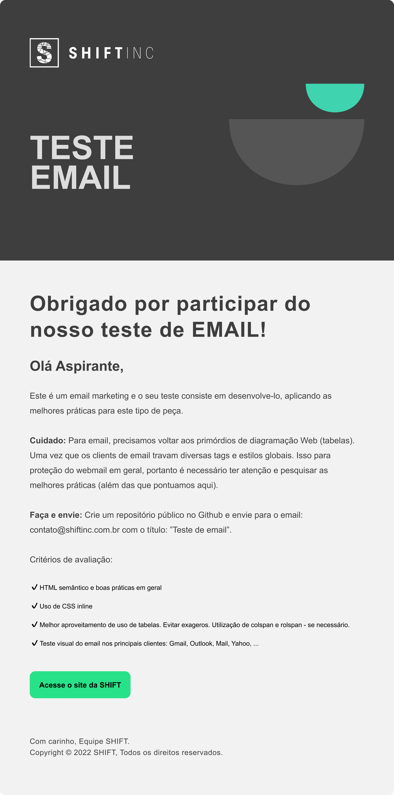
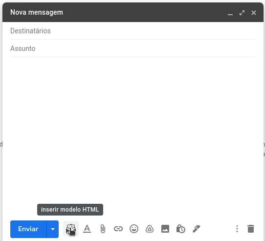
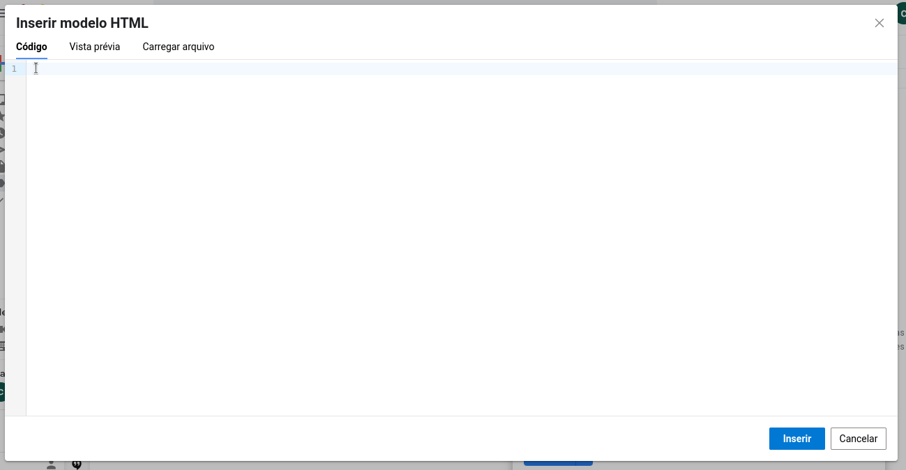

# SHIFT INC TESTE EMAIL MARKETING 

## Este projeto foi criado utilizando o framework MJML, específico para a criação de email marketing

  

# Desafio

### Fazer a criação do layout abaixo de forma satisfatória seguindo os padrões de HTML aceitos pelos clients de email.
   

(width: 484px)

   

# Instruções:

## Podemos instalar a seguinte extensão para facilitar o envio de HTML por email: 
 

https://chrome.google.com/webstore/detail/inserir-html-na-mensagem/omojcahabhafmagldeheegggbakefhlh?hl=pt-BR

 

## 1 - Após instalar esta extensão basta entrar no seu client de email web utilizando o google chrome, iniciar uma nova mensagem e clicar no icone da extensão ao lado do botão de enviar a mensagem.

 

(demonstração realizada no GMAIL)

   

## 2 - Irá abrir uma nova janela para a inserção do código ou fazer o upload do arquivo HTML

(Podemos colocar o código HTML ou importar o arquivo)

   

## 3 - Após a importação do arquivo HTML basta apenas clicar no botão de "Inserir" e logo após enviamos o email
*( Na pré visualização pode acabar mudando a resolução e o CSS do projeto, mas o email será enviado com a resolução correta assim corrigindo o CSS. )

   

## 4 - Resultado

   

# Obrigado pela oportunidade de aprender algo novo SHIFT INC